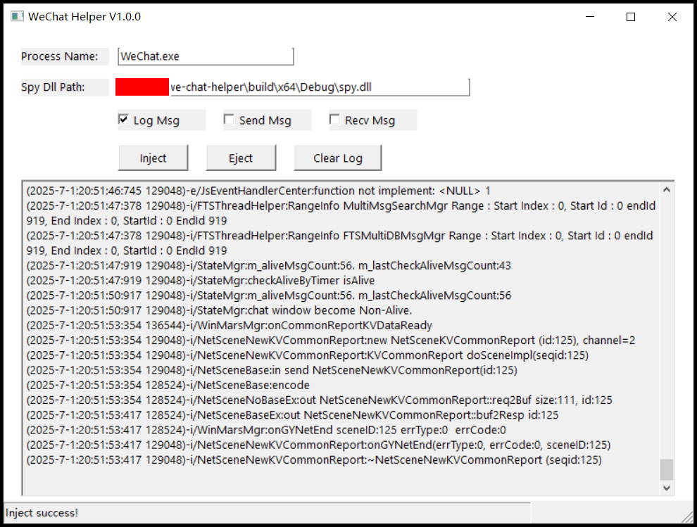

# we-chat-mod

## 1. Usage
- 

## 2. Build
- Visual Studio 2022

## 3. Function
- [x] Hook wechat log message
- [x] Hook send message content
- [x] Hook receive message content

## 4. Participate in contributing
- Fork this repository
- Create a new Feature_xxx branch
- Submit the code
- Create a new pull request
